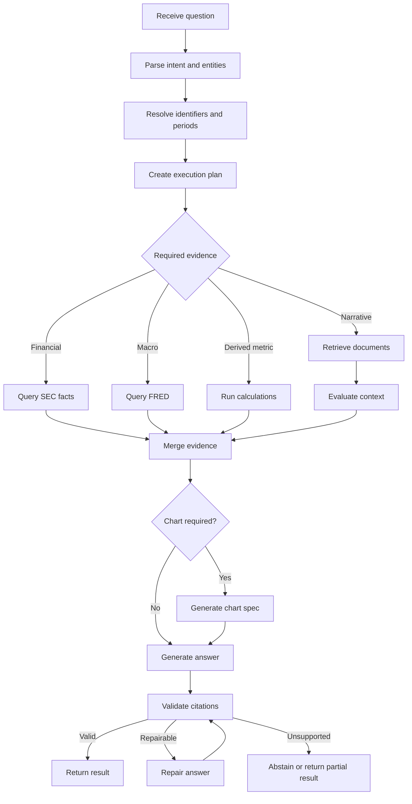

<div align="center">

# CompanyLens

### Agentic public-company intelligence powered by adaptive retrieval, structured data, and tool calling

**CompanyLens** is an AI research assistant for analysing public companies across
regulatory filings, investor documents, structured financial facts, and macroeconomic data.

</div>

CompanyLens is built around a simple constraint: different research questions require
different data paths. Narrative questions use retrieval over filings. Numerical questions
use structured facts and deterministic calculations. Hybrid questions can combine SEC facts,
FRED series, document evidence, charts, and citation validation in one bounded agent run.

## Capabilities

CompanyLens can:

- resolve companies, tickers, financial metrics, periods, and macroeconomic series;
- ingest SEC filings, SEC Company Facts, PDF documents, and FRED observations;
- retrieve filing passages with exact metadata filters and adaptive context budgets;
- query structured financial facts instead of embedding numerical tables as prose;
- run deterministic calculations such as growth, percentage change, CAGR, margin, and correlation;
- generate chart specifications from validated numerical datasets;
- produce grounded answers with claim-level citation checks;
- persist research sessions and reuse safe source results across follow-up questions.

Typical routing examples:

| Question type | Data path |
|---|---|
| What risks did management report? | Retrieval over filing sections |
| What was revenue growth? | SEC facts + deterministic calculation |
| How did risks change over three years? | Multi-document retrieval with period diversity |
| Compare growth with interest rates | SEC facts + FRED + calculation + chart |
| What does ticker `NET` refer to? | Exact entity lookup |

## Example question

> Compare Cloudflare, Datadog, and MongoDB revenue growth over the last eight quarters.
> Identify the two most frequently reported business risks for each company, explain whether
> management's outlook changed, and plot revenue growth against the federal funds rate.

A successful run resolves companies and periods, queries structured SEC facts, retrieves filing
evidence, fetches FRED data, calculates growth, builds a chart specification, validates citations,
and returns a safe execution trace.

## Architecture

Main boundaries:

- **API layer**: request validation, streaming, cancellation, and public errors.
- **Agent layer**: typed state transitions, planning, parallel branches, retries, and checkpoints.
- **Retrieval layer**: exact filters, dense and lexical retrieval, hierarchy expansion, and budgets.
- **Analytics layer**: structured queries, deterministic calculations, units, and lineage.
- **Tool adapters**: SEC, FRED, model providers, and other external systems behind typed ports.
- **Evidence layer**: claim extraction, citation validation, repair, and abstention.

## Data sources

### SEC filings

The document pipeline handles 10-K, 10-Q, selected 8-K filings, and relevant filing exhibits.
High-value sections include business overview, risk factors, MD&A, liquidity, competition,
market risk, strategy, and outlook.

### Investor documents

PDF ingestion supports annual reports, investor presentations, shareholder letters, earnings
presentations, and related documents. Page-level provenance is preserved for citations.

### SEC Company Facts

Structured metrics are normalized into relational tables rather than embedded as prose. The
pipeline uses versioned canonical metric mappings, retains duplicate/restatement provenance,
and exposes typed ingestion/query commands:

```bash
company-lens ingest-company-facts --ticker NET
company-lens query-financial-facts --ticker NET --metric revenue --fiscal-year 2025
```

### FRED

Macro series such as the federal funds rate, CPI, unemployment, Treasury yields, and GDP growth
are available through the FRED adapter.

## Agent workflow

The research agent is a bounded state machine, not an unrestricted autonomous loop.



The provider-neutral `ResearchModelProvider` separates structured parsing/planning from answer
generation. Data access is isolated behind the `ResearchTools` port; the SQL adapter opens a
separate SQLAlchemy session for each concurrent branch.

Persistent research sessions store LangGraph checkpoints in PostgreSQL, support follow-up memory,
reuse exact typed source requests, and expose inspect/resume/clear/expire commands.

```bash
company-lens research setup --pretty

company-lens research run \
  "Calculate Cloudflare revenue growth from 2024 to 2025" \
  --session-id net-demo \
  --pretty

company-lens research run \
  "Now explain what drove that change from the filings" \
  --session-id net-demo \
  --include-trajectory \
  --pretty

company-lens research inspect net-demo --pretty
company-lens research resume net-demo --pretty
company-lens research clear net-demo --yes --pretty
company-lens research expire --limit 100 --pretty
```

Every command returns JSON. `completed`, `partial`, and `abstained` are successful CLI outcomes;
`failed` returns exit code 1.

## Evidence and citations

Evidence is a first-class domain object. Supported evidence types include:

- SEC filing passages;
- PDF pages or text blocks;
- structured financial facts;
- FRED observations;
- deterministic calculations;
- derived chart datasets.

Citation validation checks that referenced evidence existed in model context, that company/period/
document/page/metric/unit metadata match the claim, and that calculation outputs retain their
input observations and formula. Unsupported claims are repaired, removed, marked unavailable, or
answered with abstention.

An optional semantic judge can additionally check qualitative claims against document evidence.
It is disabled by default and controlled through environment settings.

## Local development

Copy the environment file before running development commands:

```bash
cp .env.example .env
```

Start the full Docker developer stack with PostgreSQL, API reload, worker restart-on-change, and
Vite hot module replacement:

```bash
make migrate-dev-docker
make start-dev-docker
```

Populate the dev database with the initial company universe, SEC facts, recent filings, chunks,
and embeddings:

```bash
make index-dev
```

For a cheaper local smoke-test embedding index:

```bash
DEV_EMBEDDING_PROVIDER=local make index-dev
```

The React app is available at `http://localhost:5173`; the API is available at
`http://localhost:8000`.

For local Python development:

```bash
python -m venv .venv
source .venv/bin/activate
python -m pip install -e ".[dev]"

alembic upgrade head
company-lens research setup --pretty
make run-api
make check
```

Run the frontend separately:

```bash
corepack enable
make web-install
make web-dev
```

Do not commit real credentials. Root `.env*` files are ignored except for `.env.example`.

## Quality checks

Common local checks:

```bash
ruff check .
mypy
pytest
```

Use the Docker dev stack for development data and database checks. Local files such as
`company_lens.db` are not the source of truth for dev.

## Further documentation

- [Operations runbook](docs/operations.md)
- [Financial metrics mapping](docs/financial-metrics.md)
- [Macro analytics](docs/macro-analytics.md)
- [LangGraph research tools ADR](docs/architecture/adr-0004-langgraph-research-tools.md)
- [Persistent research sessions ADR](docs/architecture/adr-0005-persistent-research-sessions.md)
- [Frontend workspace](web/README.md)

## License

This project is licensed under the MIT License. See [LICENSE](LICENSE).
