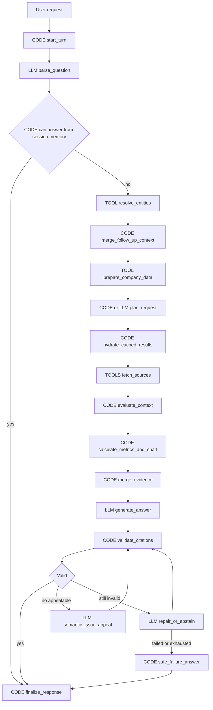

<div align="center">

# CompanyLens

### Agentic public-company intelligence powered by adaptive retrieval, structured data, and tool calling

**CompanyLens** is an AI research assistant for analysing public companies across
regulatory filings, investor documents, structured financial facts, and macroeconomic data.

</div>

CompanyLens is built around a simple constraint: different research questions require
different data paths. Narrative questions use retrieval over filings. Numerical questions
use structured facts and deterministic calculations. Hybrid questions can combine SEC facts,
FRED series, document evidence, charts, and citation validation in one bounded agent run.

## Capabilities

CompanyLens can:

- resolve companies, tickers, financial metrics, periods, and macroeconomic series;
- ingest SEC filings, SEC Company Facts, PDF documents, and FRED observations;
- retrieve filing passages with exact metadata filters and adaptive context budgets;
- query structured financial facts instead of embedding numerical tables as prose;
- run deterministic calculations such as growth, percentage change, CAGR, margin, and correlation;
- generate chart specifications from validated numerical datasets;
- produce grounded answers with claim-level citation checks;
- persist research sessions and reuse safe source results across follow-up questions.

Typical routing examples:

| Question type | Data path |
|---|---|
| What risks did management report? | Retrieval over filing sections |
| What was revenue growth? | SEC facts + deterministic calculation |
| How did risks change over three years? | Multi-document retrieval with period diversity |
| Compare growth with interest rates | SEC facts + FRED + calculation + chart |
| What does ticker `NET` refer to? | Exact entity lookup |

## Example question

> Compare Cloudflare, Datadog, and MongoDB revenue growth over the last eight quarters.
> Identify the two most frequently reported business risks for each company, explain whether
> management's outlook changed, and plot revenue growth against the federal funds rate.

A successful run resolves companies and periods, queries structured SEC facts, retrieves filing
evidence, fetches FRED data, calculates growth, builds a chart specification, validates citations,
and returns a safe execution trace.

## Architecture

Main boundaries:

- **API layer**: request validation, streaming, cancellation, and public errors.
- **Agent layer**: typed state transitions, planning, parallel branches, retries, and checkpoints.
- **Retrieval layer**: exact filters, dense and lexical retrieval, hierarchy expansion, and budgets.
- **Analytics layer**: structured queries, deterministic calculations, units, and lineage.
- **Tool adapters**: SEC, FRED, model providers, and other external systems behind typed ports.
- **Evidence layer**: claim extraction, citation validation, repair, and abstention.

## Data sources

### SEC filings

The document pipeline handles 10-K, 10-Q, selected 8-K filings, and relevant filing exhibits.
High-value sections include business overview, risk factors, MD&A, liquidity, competition,
market risk, strategy, and outlook.

### Investor documents

PDF ingestion supports annual reports, investor presentations, shareholder letters, earnings
presentations, and related documents. Page-level provenance is preserved for citations.

### SEC Company Facts

Structured metrics are normalized into relational tables rather than embedded as prose. The
pipeline uses versioned canonical metric mappings, retains duplicate/restatement provenance,
and exposes typed ingestion/query commands:

```bash
company-lens ingest-company-facts --ticker NET
company-lens query-financial-facts --ticker NET --metric revenue --fiscal-year 2025
```

### FRED

Macro series such as the federal funds rate, CPI, unemployment, Treasury yields, and GDP growth
are available through the FRED adapter.

## Agent workflow

The research agent is a bounded state machine, not an unrestricted autonomous loop.


```mermaid
flowchart TD
    A[User request] --> B[CODE start_turn]
    B --> C[LLM parse_question]
    C --> D{CODE can answer from session memory}
    D -->|yes| Z[CODE finalize_response]
    D -->|no| E[TOOL resolve_entities]
    E --> F[CODE merge_follow_up_context]
    F --> G[TOOL prepare_company_data]
    G --> H[CODE or LLM plan_request]
    H --> I[CODE hydrate_cached_results]
    I --> J[TOOLS fetch_sources]
    J --> K[CODE evaluate_context]
    K --> L[CODE calculate_metrics_and_chart]
    L --> M[CODE merge_evidence]
    M --> N[LLM generate_answer]
    N --> O[CODE validate_citations]
    O --> P{Valid}
    P -->|yes| Z
    P -->|no appealable| Q[LLM semantic_issue_appeal]
    Q --> O
    P -->|still invalid| R[LLM repair_or_abstain]
    R --> O
    R -->|failed or exhausted| S[CODE safe_failure_answer]
    S --> Z
```

Node details:

| Step | Implementation | What happens |
|---|---|---|
| `start_turn` | Code | Resets per-turn state such as draft answer, evidence, errors, citations, and repair attempts while retaining bounded session messages. |
| `parse_question` | LLM structured output | Classifies the request into route, capabilities, follow-up status, metrics, periods, and chart intent. If parsing fails, deterministic follow-up classification can recover simple follow-up requests. |
| `answer_session_context` | Code | Answers directly from session memory for narrow context questions, such as asking which period was used in the previous chart. |
| `resolve_entities` | Tool + code | Resolves companies, tickers, fiscal periods, metrics, and macro series, then merges explicit and extracted company mentions. |
| `merge_follow_up_context` | Code | If the request refers to previous work, it can inherit companies from recent resolved queries, recent chart artifacts, visible companies in the last answer, or evidence fallback. |
| `prepare_company_data` | Tool + database/indexing | Ensures requested companies have filings, chunks, embeddings, and structured facts available. If data is already available, the step is skipped. |
| `plan_request` | Code first, then LLM if needed | Applies guardrails for ambiguous or missing companies and missing financial readiness. It uses deterministic plans for supported follow-up cases; otherwise an LLM returns a typed `ExecutionPlan`. |
| `hydrate_cached_results` | Code | Reuses exact cached source results from session memory when a branch request fingerprint matches previous work. |
| `fetch_sources` | Tools | Executes planned source branches: filing retrieval, structured SEC financial facts, and FRED macro series. |
| `evaluate_context` | Code | Checks whether the fetched context is sufficient. Missing required financial data can produce an abstention with a user-facing explanation. |
| `calculate_metrics_and_chart` | Code | Runs deterministic calculations such as YoY growth, percentage change, CAGR, margin, rolling average, and correlation. Chart specs are generated from validated numeric datasets. |
| `merge_evidence` | Code | Converts retrieved facts, documents, macro observations, and calculations into `EvidenceEnvelope` records with IDs, summaries, metadata, source URLs, and lineage. |
| `generate_answer` | LLM text output | Receives conversation, question, and compact evidence context, then writes a draft answer with inline evidence IDs such as `[financial_fact:...]` and `[calculation:...]`. |
| `validate_citations` | Code | Extracts claims and checks unknown citations, missing citations, wrong company, wrong period, wrong unit, unsupported numbers, calculation lineage, and correlation-as-causation. |
| `semantic_issue_appeal` | LLM structured validation | Last-chance adjudication for likely deterministic false positives. It may only resolve `unsupported_number`, `wrong_period`, and `wrong_unit`. It cannot override wrong company, unknown citations, unsupported claims, or incomplete calculation lineage. |
| `repair_or_abstain` | LLM text output | Sends the bad draft, validation issues, invalid claim previews, compact evidence, and allowed evidence IDs to a repair prompt. The repaired draft must pass validation before it can be finalized. |
| `safe_failure_answer` | Code | If repair is exhausted or unavailable, the user sees a concise failure explanation instead of a raw evidence dump or invalid draft. |
| `finalize_response` | Code | Finalizes valid answers, stores assistant messages, updates session memory, and saves recent companies, evidence, cached sources, and chart artifacts for future follow-ups. |

For a follow-up request, the user can refer to companies from previous turns without repeating
their names. For example, if the previous answer compared Netflix and Tesla, the next request:

```text
Compare their latest revenue growth.
```

is parsed as a follow-up comparison. Entity resolution may not find explicit companies in the
new text, so the follow-up merge step inherits the companies from recent session context:

```json
{
  "question": "Compare their latest revenue growth.",
  "analysis": {
    "is_follow_up": true,
    "route": "calculation",
    "metrics": ["revenue"],
    "reason_codes": ["comparison", "follow_up"]
  },
  "resolved_query": {
    "company_ids": ["netflix-id", "tesla-id"],
    "entities": ["Netflix", "Tesla"],
    "metrics": ["revenue"]
  }
}
```

Planning then turns that into source and calculation work:

```json
{
  "route": "calculation",
  "branches": [
    {
      "kind": "query_financial_facts",
      "companies": ["Netflix", "Tesla"],
      "metric": "revenue"
    },
    {
      "kind": "calculate_metrics",
      "operation": "year_over_year_growth"
    }
  ],
  "requires_citations": true
}
```

After tools and calculations run, answer generation sees compact evidence records such as:

```json
[
  {
    "evidence_id": "financial_fact:nflx-revenue-2025",
    "kind": "financial_fact",
    "summary": "Netflix revenue: ...",
    "metadata": {
      "company_name": "Netflix",
      "metric": "revenue",
      "unit": "USD"
    }
  },
  {
    "evidence_id": "calculation:nflx-revenue-growth",
    "kind": "calculation",
    "summary": "year_over_year_growth: 12.5 percent",
    "lineage_refs": [
      "financial_fact:nflx-revenue-2024",
      "financial_fact:nflx-revenue-2025"
    ]
  }
]
```

The model draft must cite those evidence IDs:

```text
Netflix revenue grew 12.5% year over year [calculation:nflx-revenue-growth].
Tesla revenue declined 3.1% year over year [calculation:tsla-revenue-growth].
```

The validator then checks that each citation exists, each claim cites the right company and
period, cited numbers match evidence or calculation output, and calculation evidence retains
its input lineage. If validation reports an appealable issue such as `unsupported_number`,
the semantic judge receives the claim, cited evidence, and validation issue. If the judge
returns `supported` with the resolved issue code, that issue is cleared. Otherwise the answer
goes through repair or ends with a safe abstention.

The provider-neutral `ResearchModelProvider` separates structured parsing/planning from answer
generation. Data access is isolated behind the `ResearchTools` port; the SQL adapter opens a
separate SQLAlchemy session for each concurrent branch.

Persistent research sessions store LangGraph checkpoints in PostgreSQL, support follow-up memory,
reuse exact typed source requests, and expose inspect/resume/clear/expire commands.

```bash
company-lens research setup --pretty

company-lens research run \
  "Calculate Cloudflare revenue growth from 2024 to 2025" \
  --session-id net-demo \
  --pretty

company-lens research run \
  "Now explain what drove that change from the filings" \
  --session-id net-demo \
  --include-trajectory \
  --pretty

company-lens research inspect net-demo --pretty
company-lens research resume net-demo --pretty
company-lens research clear net-demo --yes --pretty
company-lens research expire --limit 100 --pretty
```

Every command returns JSON. `completed`, `partial`, and `abstained` are successful CLI outcomes;
`failed` returns exit code 1.

## Evidence and citations

Evidence is a first-class domain object. Supported evidence types include:

- SEC filing passages;
- PDF pages or text blocks;
- structured financial facts;
- FRED observations;
- deterministic calculations;
- derived chart datasets.

Citation validation checks that referenced evidence existed in model context, that company/period/
document/page/metric/unit metadata match the claim, and that calculation outputs retain their
input observations and formula. Unsupported claims are repaired, removed, marked unavailable, or
answered with abstention.

The semantic judge has two modes. Full semantic support checking for otherwise valid qualitative
document claims is optional and disabled by default. Last-chance appeal for selected deterministic
validation false positives is enabled by default through `COMPANY_LENS_SEMANTIC_JUDGE_APPEAL_ENABLED`
and uses the same validation model settings.

## Local development

Copy the environment file before running development commands:

```bash
cp .env.example .env
```

Start the full Docker developer stack with PostgreSQL, API reload, worker restart-on-change, and
Vite hot module replacement:

```bash
make migrate-dev-docker
make start-dev-docker
```

Populate the dev database with the initial company universe, SEC facts, recent filings, chunks,
and embeddings:

```bash
make index-dev
```

For a cheaper local smoke-test embedding index:

```bash
DEV_EMBEDDING_PROVIDER=local make index-dev
```

The React app is available at `http://localhost:5173`; the API is available at
`http://localhost:8000`.

Reranking is disabled by default so the backend image stays free of Torch,
Transformers, and `sentence-transformers`. To opt into the separate local ML
reranker service:

```bash
COMPOSE_PROFILES=reranker \
COMPANY_LENS_RERANKER_PROVIDER=http \
make start-dev-docker
```

Backend settings:

| Setting | Default | Purpose |
|---|---|---|
| `COMPANY_LENS_RERANKER_PROVIDER` | `noop` | Selects disabled/noop or HTTP reranking. |
| `COMPANY_LENS_RERANKER_URL` | `http://reranker:8080` | Internal reranker service URL. |
| `COMPANY_LENS_RERANKER_TIMEOUT_SECONDS` | `2.0` | Bounds one reranker request. |
| `COMPANY_LENS_RERANKER_FAIL_CLOSED` | `false` | Fallback by default; fail retrieval in strict evaluation. |

The service image uses `Dockerfile.reranker`, reads `reranker/pyproject.toml`, and caches model
weights in the `reranker-model-cache` Docker volume. Run
`company-lens benchmark-retrieval --compare-reranking` to compare baseline and reranked retrieval
rows on the synthetic benchmark.

For local Python development:

```bash
python -m venv .venv
source .venv/bin/activate
python -m pip install -e ".[dev]"

alembic upgrade head
company-lens research setup --pretty
make run-api
make check
```

Run the frontend separately:

```bash
corepack enable
make web-install
make web-dev
```

Do not commit real credentials. Root `.env*` files are ignored except for `.env.example`.

## Quality checks

Common local checks:

```bash
ruff check .
mypy
pytest
```

Use the Docker dev stack for development data and database checks. Local files such as
`company_lens.db` are not the source of truth for dev.

## Further documentation

- [Operations runbook](docs/operations.md)
- [Financial metrics mapping](docs/financial-metrics.md)
- [Macro analytics](docs/macro-analytics.md)
- [LangGraph research tools ADR](docs/architecture/adr-0004-langgraph-research-tools.md)
- [Persistent research sessions ADR](docs/architecture/adr-0005-persistent-research-sessions.md)
- [Frontend workspace](web/README.md)

## License

This project is licensed under the MIT License. See [LICENSE](LICENSE).
