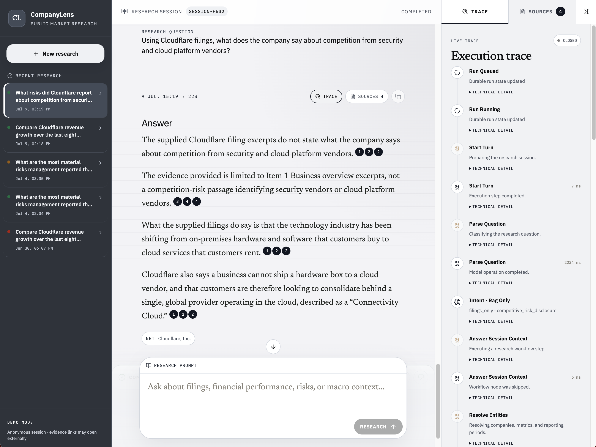

<div align="center">

# CompanyLens

### A learning project about building — and evaluating — an AI research agent


</div>

CompanyLens is a learning project I built to better understand what it really takes to create and
improve an AI research agent.

My goal was not just to build another chatbot. I wanted to explore how an agent finds trustworthy
information, decides which sources matter, combines written evidence with financial data, and
produces answers that can be checked.

To make that concrete, CompanyLens researches public companies. It can work with SEC filings,
investor PDFs, structured financial facts, and FRED macroeconomic data; calculate metrics; prepare
charts; and cite the evidence behind its claims.



## What I Explored — and What Comes Next

- **RAG (Retrieval-Augmented Generation)**: before answering, the agent searches its source
  collection and gives the model the most relevant passages. This keeps the answer connected to
  evidence instead of relying only on what the model already knows.
- **Re-ranking**: search usually finds several possible passages. An optional reranker reads the
  question and passages together, then moves the strongest evidence toward the top.
- **Query rewriting**: some questions are too vague for search. Query rewriting turns them into
  more focused search phrases. This is the next planned retrieval experiment; the current agent
  does not use it yet.

## Evaluation Was Half the Project

A convincing demo can still be a lucky run. I wanted a repeatable way to see whether the agent was
actually getting better.

CompanyLens keeps reviewed test questions in the repository and runs the agent against them.
**Langfuse** makes each evaluation run visible: I can inspect what the agent did, review scores for
individual cases, and compare the overall result after changing a prompt, model, retrieval strategy,
or workflow step.

This helped me:

- trace a failure to a specific part of the agent instead of guessing;
- catch regressions in tool choice, follow-up questions, citations, and operational limits;
- compare changes using the same questions and scoring rules;
- notice when the evaluation itself was wrong.

For example, one run looked as if the agent had exceeded its API-call budget. The Langfuse trace
showed that the case had legitimately been retried, but both attempts were being measured against a
one-attempt limit. That led to a clearer, replay-aware evaluation rule.

Read the technical explanation in [Evaluation and Langfuse](docs/portfolio/evaluation-and-langfuse.md).

## Technology

The project uses **Python**, **FastAPI**, and **LangGraph** for the agent and API;
**PostgreSQL with pgvector** for data and retrieval; **OpenAI models** for planning and answers;
**Langfuse** for evaluation visibility; **React** for the research interface; and **Docker** for the
development stack. Re-ranking can run as a separate cross-encoder service.

## Technical Deep Dives

For implementation details:

| Topic | Document |
|---|---|
| RAG, adaptive retrieval, re-ranking, and planned query rewriting | [Retrieval and reranking](docs/portfolio/retrieval-and-reranking.md) |
| Evaluation workflow and Langfuse | [Evaluation and Langfuse](docs/portfolio/evaluation-and-langfuse.md) |
| Agent workflow | [Research graph](docs/portfolio/research-graph.md) |
| Complete research example | [Hybrid query walkthrough](docs/portfolio/hybrid-query-walkthrough.md) |
| API and operations | [Research API](docs/research-api.md) · [Operations runbook](docs/operations.md) |

## Run It Locally

Create an environment file and fill in the credentials required for the features you want to run:

```bash
cp .env.example .env
make migrate-dev-docker
make start-dev-docker
make index-dev
```

The research interface runs at `http://localhost:5173`; the API runs at
`http://localhost:8000`.

Run the local quality gate with:

```bash
make check
```

## License

This project is licensed under the MIT License. See [LICENSE](LICENSE).
