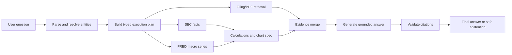

<div align="center">

# CompanyLens

### Agentic public-company research with adaptive retrieval, structured facts, and cited answers


</div>

CompanyLens is a portfolio project that shows how an AI research agent can answer
public-company questions without treating every problem as plain text search.

Narrative questions go through filing and PDF retrieval. Numerical questions use
structured SEC facts and deterministic calculations. Hybrid questions can combine
company filings, SEC Company Facts, FRED macro series, charts, and citation validation
inside one bounded agent run.

## What It Shows

- **Adaptive Retrieval**: exact entity filters, dense vector search, lexical search,
  hybrid Reciprocal Rank Fusion, hierarchy expansion, dedupe, diversity, and bounded context.
- **Typed Agent Graph**: a LangGraph workflow plans source branches, runs safe tool calls,
  merges evidence, generates an answer, and validates citations.
- **Structured Financial Facts**: revenue, margins, growth, and related metrics come from
  typed SEC facts instead of embedding numerical tables as prose.
- **Optional Reranking**: a separate ML reranker service can rescore retrieved chunks before
  final evidence selection while the backend remains lightweight by default.
- **Citation Validation**: generated claims must cite evidence IDs that were actually supplied
  to the model, with company, period, unit, and calculation lineage checks.
- **Persistent Sessions**: PostgreSQL-backed LangGraph checkpoints support follow-up questions,
  cached source reuse, run inspection, resume, expiry, and safe cancellation.

## Example Question

> Compare Cloudflare, Datadog, and MongoDB revenue growth over the last eight quarters.
> Identify the two most frequently reported business risks for each company, explain whether
> management's outlook changed, and plot revenue growth against the federal funds rate.

For that kind of request, CompanyLens resolves the companies and periods, prepares missing source
data, queries structured SEC facts, retrieves relevant filing passages, optionally reranks document
chunks, fetches FRED observations, calculates growth, builds a chart spec, and validates every cited
answer before final output.

## How It Works


```mermaid
flowchart LR
    Q["User question"] --> A["Parse and resolve entities"]
    A --> P["Build typed execution plan"]
    P --> F["SEC facts"]
    P --> R["Filing/PDF retrieval"]
    P --> M["FRED macro series"]
    F --> C["Calculations and chart spec"]
    R --> E["Evidence merge"]
    M --> C
    C --> E
    E --> G["Generate grounded answer"]
    G --> V["Validate citations"]
    V --> O["Final answer or safe abstention"]
```

The agent is deliberately bounded: it uses typed plans, fixed tool ports, retry budgets, public
trace events, and citation repair/abstention instead of an unrestricted autonomous loop.

## Read The Deep Dives

| Topic | What to read |
|---|---|
| Agent workflow | [Research graph](docs/portfolio/research-graph.md) |
| Retrieval, source graph, reranking | [Retrieval and reranking](docs/portfolio/retrieval-and-reranking.md) |
| End-to-end hybrid example | [Hybrid query walkthrough](docs/portfolio/hybrid-query-walkthrough.md) |
| API events and public traces | [Research API and SSE](docs/research-api.md) |
| Operations and safety boundaries | [Operations runbook](docs/operations.md) |
| Architecture decisions | [ADR index](docs/architecture/adr-0004-langgraph-research-tools.md) |

## Data Sources

- SEC filings: 10-K, 10-Q, selected 8-K filings, exhibits, and source metadata.
- Investor documents: annual reports, investor decks, shareholder letters, and earnings PDFs.
- SEC Company Facts: typed XBRL observations with metrics, periods, units, and lineage.
- FRED: macro series such as federal funds rate, CPI, unemployment, Treasury yields, and GDP growth.

## Local Development

Copy the environment file, then use the Docker dev stack:

```bash
cp .env.example .env
make migrate-dev-docker
make start-dev-docker
make index-dev
```

The React app runs at `http://localhost:5173`; the API runs at `http://localhost:8000`.

Reranking is disabled by default. To run the optional local reranker service:

```bash
COMPOSE_PROFILES=reranker \
COMPANY_LENS_RERANKER_PROVIDER=http \
make start-dev-docker
```

Common checks:

```bash
make check
```

Use the Docker dev stack for development data and database checks. Local files such as
`company_lens.db` are not the source of truth for dev.

## License

This project is licensed under the MIT License. See [LICENSE](LICENSE).
