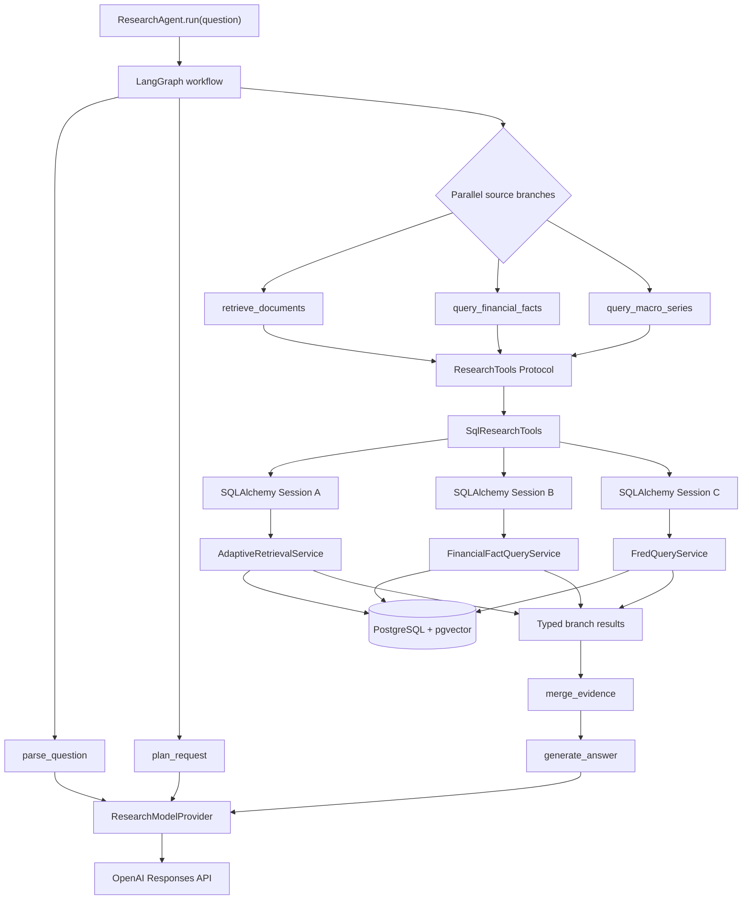
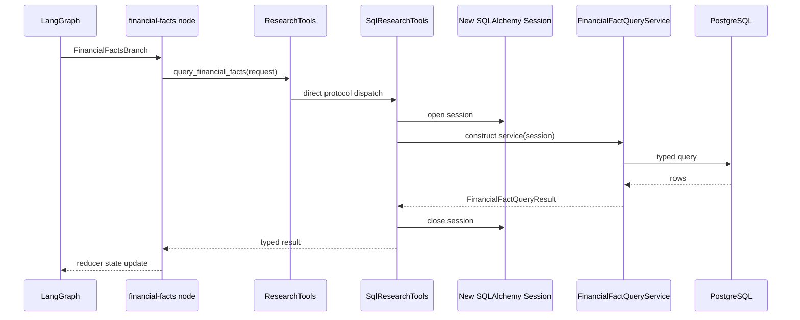
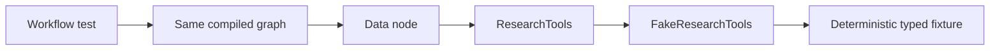

# ADR 0004: Stateless LangGraph Workflow And Research Tools Port

## Status

Accepted

## Context

CompanyLens must route a question through model planning, exact entity resolution, document
retrieval, structured financial facts, cached macro series, deterministic analytics, charts,
and grounded answer generation. These operations have different dependencies and failure modes.
The data branches must run concurrently without sharing a SQLAlchemy `Session`, and graph tests
must not require PostgreSQL, pgvector, OpenAI, or FRED.

LangChain `StructuredTool` wrappers already exist for selected services. They are useful when a
model chooses and invokes tools dynamically. The CompanyLens workflow is different: the model
returns a typed `ExecutionPlan`, and the graph deterministically decides which bounded branches
to execute. Routing those calls through JSON-shaped `StructuredTool` wrappers would discard
useful request/result types and would couple concurrent nodes to captured service instances.

## Decision

The agent uses ports and adapters. `ResearchTools` is a synchronous Python `Protocol` containing
the data operations available to graph nodes. `SqlResearchTools` is the production adapter over
the existing entity-resolution, adaptive-retrieval, financial-fact, and FRED query services.
`ResearchModelProvider` remains a separate port for parse, plan, answer, and repair calls.



The protocol is a type boundary, not an additional runtime service. At runtime,
`SqlResearchTools` implements the methods directly:

```python
class ResearchTools(Protocol):
    def resolve_entities(self, query: str) -> ResolvedQuery: ...
    def retrieve_documents(
        self, request: AdaptiveRetrievalRequest
    ) -> AdaptiveRetrievalResponse: ...
    def query_financial_facts(
        self, request: FinancialFactQuery
    ) -> FinancialFactQueryResult: ...
    def query_macro_series(self, request: FredSeriesQuery) -> FredSeriesResult: ...
```

The model provider and tools implementation are supplied through typed LangGraph runtime context.
Mutable run data stays in `AgentState`; immutable dependencies stay in `ResearchAgentRuntime`.
The OpenAI planning boundary uses a flattened `ModelExecutionPlan` DTO because Structured Outputs
does not accept the domain plan's discriminated-union `oneOf` schema. The DTO is converted into and
validated as the stricter `ExecutionPlan` before any source branch can run.



Every adapter method owns a short-lived session. Parallel graph workers never share one session.
Model calls do not pass through `ResearchTools`, and deterministic calculations and chart shaping
remain pure workflow operations.

The graph uses dynamic `Send` fan-out for independent source and calculation branches. Typed tuple
reducers combine parallel updates. Evidence is sorted by stable ID after fan-in so completion order
does not affect answer context. Tool-call retries are allocated before dispatch and cannot exceed
the run policy. Optional failures produce partial results; required failures produce explicit failed
or abstained states.

Citation validation in this workflow is deliberately structural: answer markers must reference an
evidence ID that was supplied to the model. Claim extraction and semantic support validation remain
the responsibility of issue #13.

## Testing

Graph tests inject `FakeResearchTools` and a scripted `ResearchModelProvider`:



This tests routing, parallelism, retries, budgets, calculations, evidence merge, citations, repair,
and abstention without network calls. Adapter tests separately verify session ownership and service
delegation.

## Adding Data Sources

A new source adds a typed request/result schema, one `ResearchTools` method, a production adapter
implementation, an execution-branch type, a graph node, and an evidence mapper. Planning, retries,
session handling, answer generation, and citation validation remain unchanged.

For the current number of integrations, explicit protocol methods provide the strongest typing and
the clearest graph. If the source count grows substantially, the port can evolve into a typed adapter
registry such as `tools.register("world_bank", world_bank_adapter)`. A registry is intentionally not
introduced yet because it would add lookup and schema-dispatch complexity without current benefit.

## Consequences

The workflow is stateless between invocations but fully executable within one run. It is isolated
from concrete model and database implementations, supports safe concurrent branches, and exposes a
typed trajectory. Checkpoint persistence, session-scoped memory, resume, expiry, and CLI surfaces
remain subsequent commits for issue #12.
