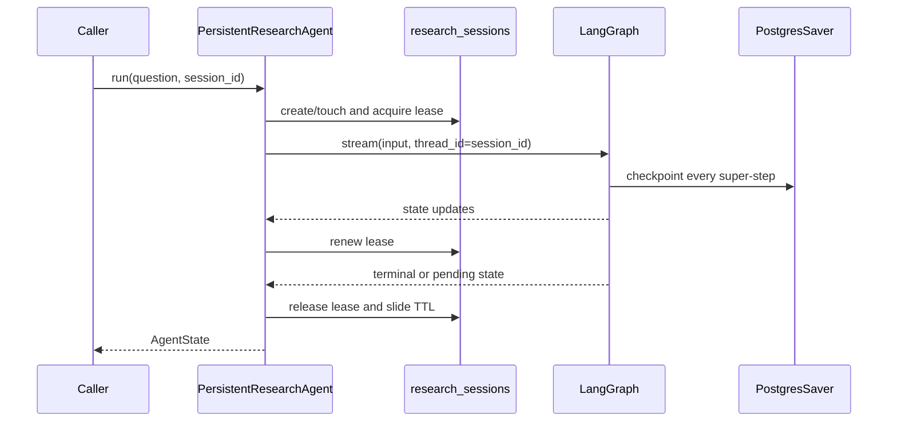
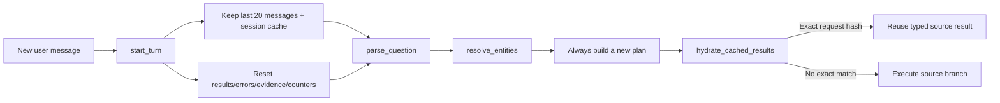

# ADR 0005: Persistent Research Sessions And Checkpoints

## Status

Accepted

## Context

The stateless research graph can complete one bounded question, but it cannot continue a
conversation after process restart, inspect an unfinished run, or avoid repeating an identical
data query in a follow-up. Sharing an OpenAI conversation ID would move state outside CompanyLens
and would not preserve deterministic graph/tool checkpoints.

## Decision

CompanyLens uses LangGraph threads with a PostgreSQL `PostgresSaver`. The public `session_id` is
the LangGraph `thread_id`; a checkpoint is written at every graph super-step. Successful writes
from parallel branches therefore remain durable when another task or the process fails.

An application-owned `research_sessions` table stores lifecycle metadata that the generic
checkpointer does not manage: sliding expiry, turn count, last/active run IDs, and a renewable
execution lease. LangGraph creates and migrates its private checkpoint tables through the explicit
`PostgresSaver.setup()` operation. Alembic owns `research_sessions`.

The graph starts each new turn with `start_turn`. It preserves bounded conversation/session memory
and resets all run-scoped channels with `Overwrite`. Custom reducers accept either lists restored
by a serializer or tuples emitted by nodes and always return immutable tuples. Resume starts from
the pending checkpoint and does not execute `start_turn` again.

Follow-up resolution fills only entity fields omitted from the new question. Explicit current
company, metric, period, form, accession, or date values always win. The previous plan is model
context only; it is never executed again without new validation.

Successful document, financial, and FRED results are cached by SHA-256 of the branch kind and
canonical typed request. Exact matches are rebound to the current branch ID with zero attempts and
zero tool-call cost. Calculations, charts, evidence merge, answer generation, and citation checks
always rerun. The latest state retains at most 20 messages and 20 source cache entries.

## Lifecycle Rules

- A session has one active run. A 15-minute lease is renewed as graph values stream.
- A new question is rejected while a checkpoint has pending nodes; callers must resume or clear.
- Resume is rejected for completed sessions and while another non-expired lease is active.
- Successful run/resume slides expiry by 24 hours.
- Clear hard-deletes metadata, checkpoints, blobs, and pending writes.
- Expiry cleanup deletes only inactive or expired-lease sessions and is explicitly invoked.
- A new run with an expired session ID starts clean after deleting the old thread.

`inspect_session` exposes lifecycle metadata, latest safe `AgentState`, checkpoint ID, and pending
node names. Raw checkpoint blobs, writes, channel versions, and complete checkpoint history remain
internal implementation details.

Checkpoint deserialization uses `JsonPlusSerializer` without pickle fallback and an explicit
allowlist of CompanyLens schema modules. Graph invocation metadata includes session ID, run ID,
environment, and graph version so issue #16 can attach Langfuse or another observability backend
without changing persistence semantics.

## Consequences

Sessions survive process reconstruction and support bounded multi-turn reuse without OpenAI-managed
conversation state. PostgreSQL is the source of truth for resume and deletion. Applications must run
the normal Alembic migration and explicitly initialize the LangGraph checkpoint schema once.

This decision does not add CLI/API surfaces, background cleanup scheduling, cancellation, LangSmith,
Langfuse, cross-session personalization, or public checkpoint-history APIs.
