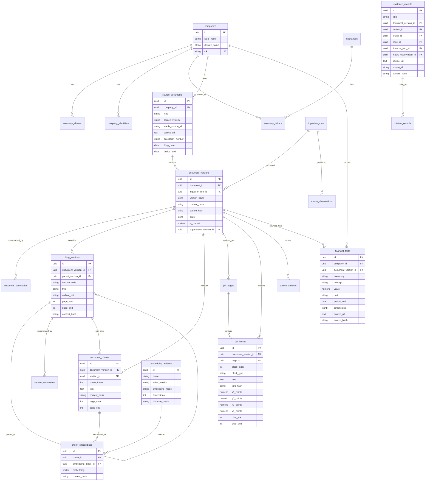

# Core Domain ER Diagram

```mermaid
erDiagram
    companies ||--o{ company_aliases : has
    companies ||--o{ company_identifiers : has
    companies ||--o{ company_tickers : trades_as
    exchanges ||--o{ company_tickers : lists
    companies ||--o{ source_documents : owns
    source_documents ||--o{ document_versions : versions
    ingestion_runs ||--o{ document_versions : produced
    ingestion_runs ||--o{ macro_observations : produced
    document_versions ||--o{ document_summaries : summarized_by
    document_versions ||--o{ filing_sections : contains
    filing_sections ||--o{ filing_sections : parent_of
    filing_sections ||--o{ section_summaries : summarized_by
    filing_sections ||--o{ document_chunks : split_into
    document_versions ||--o{ document_chunks : contains
    document_versions ||--o{ pdf_pages : renders_as
    document_versions ||--o{ pdf_blocks : extracts
    pdf_pages ||--o{ pdf_blocks : contains
    document_versions ||--o{ source_artifacts : stores
    document_chunks ||--o{ chunk_embeddings : embedded_as
    embedding_indexes ||--o{ chunk_embeddings : indexes
    companies ||--o{ financial_facts : reports
    document_versions ||--o{ financial_facts : sourced_from
    evidence_records ||--o{ citation_records : cited_as

    companies {
        uuid id PK
        string legal_name
        string display_name
        string cik UK
    }

    source_documents {
        uuid id PK
        uuid company_id FK
        string kind
        string source_system
        string stable_source_id
        text source_url
        string accession_number
        date filing_date
        date period_end
    }

    document_versions {
        uuid id PK
        uuid document_id FK
        uuid ingestion_run_id FK
        string version_label
        string content_hash
        string source_hash
        string state
        boolean is_current
        uuid supersedes_version_id FK
    }

    filing_sections {
        uuid id PK
        uuid document_version_id FK
        uuid parent_section_id FK
        string section_code
        string title
        string ordinal_path
        int page_start
        int page_end
        string content_hash
    }

    document_chunks {
        uuid id PK
        uuid document_version_id FK
        uuid section_id FK
        int chunk_index
        text text
        string content_hash
        int page_start
        int page_end
    }

    pdf_blocks {
        uuid id PK
        uuid document_version_id FK
        uuid page_id FK
        int block_index
        string block_type
        text text
        string text_hash
        numeric x0_points
        numeric y0_points
        numeric x1_points
        numeric y1_points
        int char_start
        int char_end
    }

    embedding_indexes {
        uuid id PK
        string name
        string index_version
        string embedding_model
        int dimensions
        string distance_metric
    }

    chunk_embeddings {
        uuid id PK
        uuid chunk_id FK
        uuid embedding_index_id FK
        vector embedding
        string content_hash
    }

    financial_facts {
        uuid id PK
        uuid company_id FK
        uuid document_version_id FK
        string taxonomy
        string concept
        numeric value
        string unit
        date period_end
        jsonb dimensions
        text source_url
        string source_hash
    }

    evidence_records {
        uuid id PK
        string kind
        uuid document_version_id FK
        uuid section_id FK
        uuid chunk_id FK
        uuid page_id FK
        uuid financial_fact_id FK
        uuid macro_observation_id FK
        text source_url
        string source_id
        string content_hash
    }
```
