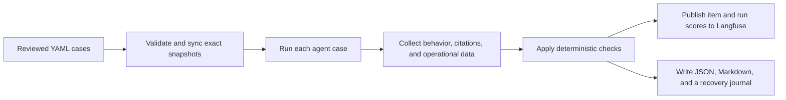

# Evaluation And Langfuse

CompanyLens treats evaluation as part of agent development, not as a final demonstration. A single
successful answer says very little about whether the agent is reliable, so the project runs the same
reviewed cases repeatedly and records both behavior and operational results.

## Where The Expected Behavior Lives

CompanyLens keeps its reviewed evaluation cases as plain YAML files in the repository. They are
split into two slices:

- `core.v1.yaml` covers structured financial questions, document retrieval, hybrid analysis,
  ambiguous or missing companies, adversarial instructions, and cross-document comparisons.
- `follow_up.v1.yaml` covers session memory, safe context reuse, replacing or adding companies, and
  abstaining when a follow-up target cannot be resolved.

Langfuse is where those cases are run and compared. Synchronization gives each case a stable
identity, archives stale remote items, and verifies an exact dataset snapshot before a live
evaluation begins. Changes to expected behavior are reviewed in the repository and then
synchronized to Langfuse.

## Evaluation Flow



Before the first model-backed case runs, the evaluator verifies the configured Langfuse project,
repository dataset hashes, remote snapshots, score definitions, model settings, prompt and parser
versions, retrieval index identity, and execution policy. These inputs are frozen in a manifest so a
later replay can use the same evaluated configuration.

Each case runs in an isolated research session. The evaluator observes the final structured state
instead of trying to grade private model reasoning.

## What Is Scored

The foundation begins with deterministic checks so failures are reproducible and explainable.

| Area | Examples |
|---|---|
| Question understanding | Resolved companies, financial metrics, requested calculation, and route |
| Agent behavior | Required tools ran, prohibited tools did not run, and follow-up context was reused safely |
| Grounding | Required citations exist and pass the agent's citation validation |
| Operations | Latency, retries, tool calls, model calls, token use, and cost remain within configured limits |
| Overall result | Per-case pass status, category pass rates, and a trusted run gate |

Applicable scores are published on each Langfuse dataset item. Completed runs also receive
aggregate and category scores. If infrastructure prevents a trustworthy result, the run is marked
`not_evaluated` and does not publish misleading aggregate quality scores.

## What Langfuse Added In Practice

Langfuse connects a dataset case, its agent trace, and its scores. That made several failures easier
to understand than a pass/fail report alone:

- A follow-up evaluation exposed a plan that referred to a source by its dataset alias while another
  part of the workflow expected a branch ID. The failing run localized the mismatch, leading to
  canonical reference handling and controlled validation errors instead of a `KeyError`.
- An operation-reconciliation trace showed that company-qualified duplicate metrics were creating a
  false conflict. The trace recorded why reconciliation ran and what it decided, which led to a fix
  in metric-equivalence handling.
- A full evaluation appeared to exceed a ten-call API budget. The trace showed a valid whole-case
  replay with two attempts. The evaluation model was updated to record case attempts and enforce the
  ten-call ceiling per attempt while keeping total latency, token, and cost limits across the case.

These examples are why observability and evaluation belong together: a score identifies that
something changed, while the trace provides the context needed to understand the change.

## Local Artifacts And Recovery

Every execution also writes a recovery journal, immutable JSON execution record, and Markdown
summary. The journal is updated after terminal transitions so interrupted runs can still produce a
partial, trustworthy report without repeating provider or Langfuse calls.

Local public artifacts intentionally omit raw prompts, final answers, evidence passages, provider
payloads, credentials, exception text, and stack traces. They retain stable identifiers, safe
failure codes, scores, and links needed to inspect the corresponding Langfuse runs.

## Running A Small Evaluation

Preview dataset synchronization without remote writes:

```bash
company-lens sync-evaluation-datasets \
  --dataset evals/datasets/golden/core.v1.yaml \
  --dataset evals/datasets/golden/follow_up.v1.yaml \
  --score-contract evals/score-contracts/foundation.v1.yaml \
  --dry-run \
  --pretty
```

Run two live cases after configuring the required PostgreSQL, OpenAI, SEC, and Langfuse values:

```bash
company-lens run-evaluation \
  --dataset evals/datasets/golden/core.v1.yaml \
  --gate evals/gates/eval-full.v1.yaml \
  --score-contract evals/score-contracts/foundation.v1.yaml \
  --output-dir artifacts/evaluations/manual-smoke \
  --max-cases 2 \
  --max-concurrency 1 \
  --pretty
```

## Reference Files

- [Golden dataset guide](../../evals/datasets/golden/README.md)
- [Deterministic score contract](../../evals/score-contracts/foundation.v1.yaml)
- [Evaluation orchestrator](../../src/company_lens/evals/orchestrator.py)
- [Langfuse dataset synchronization](../../src/company_lens/evals/langfuse_sync.py)
- [Langfuse experiment runner](../../src/company_lens/evals/langfuse_experiment.py)
- [Full validation quickstart](../../specs/003-langfuse-evaluation-foundation/quickstart.md)
