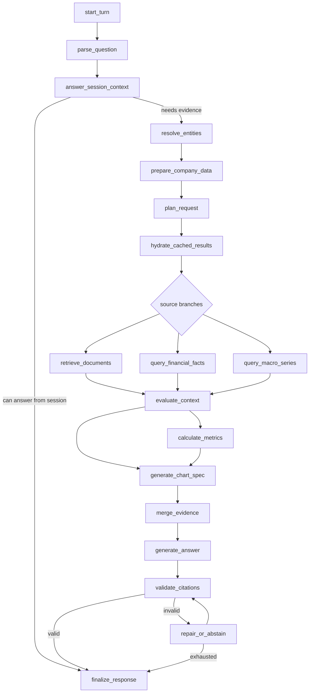

# Research Graph

CompanyLens uses a LangGraph workflow to turn one research question into a bounded sequence of
typed steps. The model is important, but it is not allowed to freely browse tools forever. The graph
decides which nodes can run, which tools are available, how retries are counted, and when an answer
must be repaired or replaced with a safe abstention.

## The Short Version

Each node has a narrow job. Some nodes call a model. Some nodes call tools. Many are plain
application code.

## Model Calls

| Step | What the model does | Why it is bounded |
|---|---|---|
| `parse_question` | Classifies route, metrics, periods, follow-up status, and chart intent. | It returns structured output, not arbitrary commands. |
| `plan_request` | Produces a typed `ExecutionPlan` only when deterministic planning is not enough. | The plan is validated before any source branch runs. |
| `generate_answer` | Writes the final draft from compact evidence records. | It only sees selected evidence IDs and summaries. |
| `repair_or_abstain` | Repairs invalid citation usage or produces a safe failure answer. | The repaired answer must pass validation. |
| semantic appeal | Can clear selected deterministic false positives. | It cannot override unknown citations, wrong company, or unsupported claims. |

## Tool Calls

The graph talks to data through the `ResearchTools` protocol. In production, `SqlResearchTools`
implements that protocol and opens a fresh SQLAlchemy session for each call so parallel branches do
not share a database session.

| Tool call | What it returns |
|---|---|
| `resolve_entities` | Companies, tickers, filings, fiscal periods, metrics, and macro series found in the question. |
| `prepare_companies` | On-demand ingestion/indexing status for requested companies. |
| `retrieve_documents` | Adaptive document evidence with strategy, context, lineage, and reranker trace summary. |
| `query_financial_facts` | Typed SEC Company Facts observations with periods, units, and provenance. |
| `query_macro_series` | FRED observations and warnings for requested macro series. |

The model does not call these tools directly. It proposes a typed plan, and the graph dispatches the
allowed branches.

## Public Trace

The UI and API expose educational trace events so a reader can see what the agent did:

- `analysis.summary`: route, capabilities, follow-up status, and chart intent.
- `entities.summary`: resolved, ambiguous, or unresolved public filters.
- `plan.summary`: branch graph and sanitized typed requests.
- `node.status`: graph node lifecycle and duration.
- `tool.status`: source branch status, attempts, result counts, warnings, and formulas.
- `validation.summary`: citation and claim validation outcomes.
- `chart.ready`: chart type, title, series count, point count, and source count.
- `answer.token`: deterministic chunks from the validated final answer.

The public trace deliberately excludes prompts, private reasoning, raw provider payloads, raw
retrieved passages, credentials, stack traces, and citation-invalid drafts.

## Why This Shape Matters

Company research mixes different evidence types. A question about revenue growth should not depend
on vector search over a table. A question about risk factors should not depend only on structured
facts. A question that combines both needs branches that can run independently, preserve lineage,
and join back into one answer.

That is the main purpose of the graph: keep the workflow explainable while still letting the agent
combine retrieval, structured facts, macro data, calculations, charts, and citation validation.

## Reference Docs

- [LangGraph research tools ADR](../architecture/adr-0004-langgraph-research-tools.md)
- [Persistent research sessions ADR](../architecture/adr-0005-persistent-research-sessions.md)
- [Research API and SSE](../research-api.md)
