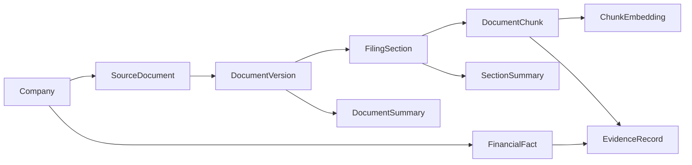

# Retrieval And Reranking

CompanyLens retrieval is built around a simple idea: a retrieved passage is only useful if the
system can trace it back to the company, document, version, section, page, period, and source URL
that produced it.

## Source Graph



The graph is stored in relational tables, not only in a vector index. Dense search can find a
similar chunk, but the answer still needs metadata: which filing, which fiscal period, which page,
which section, and which source URL.

## Adaptive Strategies

`AdaptiveRetrievalService` sits above the lower-level `RetrievalService`. It first resolves exact
entities and then chooses a strategy:

| Strategy | When it is useful |
|---|---|
| `none` | The question needs no evidence, or an exact identifier is ambiguous or missing. |
| `summary_only` | The user asks for a high-level overview. |
| `section_level` | The question points at known filing sections such as risks, business, or MD&A. |
| `detailed` | The question needs source chunks from filings or PDFs. |
| `structured_only` | The question is about known financial metrics that should come from typed facts. |
| `hybrid` | The answer needs both structured facts and narrative evidence. |

Every plan carries exact filters and a retrieval budget: maximum documents, sections, chunks,
tokens, companies, periods, and attempts. Comparative questions receive larger budgets than simple
lookups.

## First-Stage Retrieval

The baseline retrieval unit is `DocumentChunk`.

1. Apply exact filters first: company IDs, accession numbers, forms, dates, fiscal years, fiscal
   periods, section codes, source systems, and document versions.
2. Run dense retrieval with pgvector cosine distance against the configured embedding index.
3. Run lexical retrieval with PostgreSQL full-text search.
4. Merge dense and lexical lists with Reciprocal Rank Fusion in `hybrid` mode.
5. Attach lineage: parent section, document, company, filing metadata, period, page, source URL,
   source ID, and content hash.

The baseline `RetrievalRequest` defaults to `top_k=10`, `dense_candidate_limit=50`, and
`lexical_candidate_limit=50`. The adaptive layer uses bounded chunk attempts; for chunk retrieval it
sets candidate limits with `max(20, top_k * 3)` and increases `top_k` across retry attempts while
staying inside the retrieval budget.

## Reranking

Reranking is a second-stage ordering step. It does not replace retrieval, filters, dedupe,
diversity, or citation validation.


When reranking is enabled, the backend sends candidate chunk IDs and text to an internal reranker
service. The service scores query-document pairs and returns finite numeric scores where larger
means more relevant. The backend then sorts candidates by reranker score before dedupe, diversity,
and final top-k selection.

The default provider is `noop`, so standard local and CI runs keep first-stage ordering and avoid
ML runtime dependencies. HTTP reranking is opt-in through:

```bash
COMPOSE_PROFILES=reranker \
COMPANY_LENS_RERANKER_PROVIDER=http \
make start-dev-docker
```

If the HTTP reranker times out, returns invalid JSON, is unavailable, or returns partial scores,
normal product mode falls back to first-stage ordering or partial accepted scores. Strict evaluation
mode can fail closed instead.

Diagnostics are intentionally privacy-safe. They can include provider, status, model identity,
candidate count, scored count, latency, fallback reason, final reranker score, and final reranker
rank. They must not include raw chunk text, raw reranker payloads, credentials, stack traces, or
hidden reasoning.

## Planned Next: Query Rewriting

Query rewriting is planned, not implemented in the current retrieval path. The intended direction is
to add a bounded rewrite or expansion step before first-stage retrieval, for example turning:

```text
What changed in management's outlook?
```

into targeted retrieval phrases such as:

```text
management outlook guidance demand environment liquidity risk factors
```

The important constraint is that rewriting should remain inspectable. A future implementation should
record the rewritten query, keep the original user question, and make it clear which query was used
for dense search, lexical search, and reranking.

## Reference Docs

- [Core domain hierarchy and source lineage ADR](../architecture/adr-0001-core-domain-source-lineage.md)
- [Baseline retrieval ADR](../architecture/adr-0002-baseline-retrieval.md)
- [Adaptive hierarchical retrieval ADR](../architecture/adr-0003-adaptive-hierarchical-retrieval.md)
- [ML reranker feature spec](../../specs/002-ml-reranker-service/spec.md)
